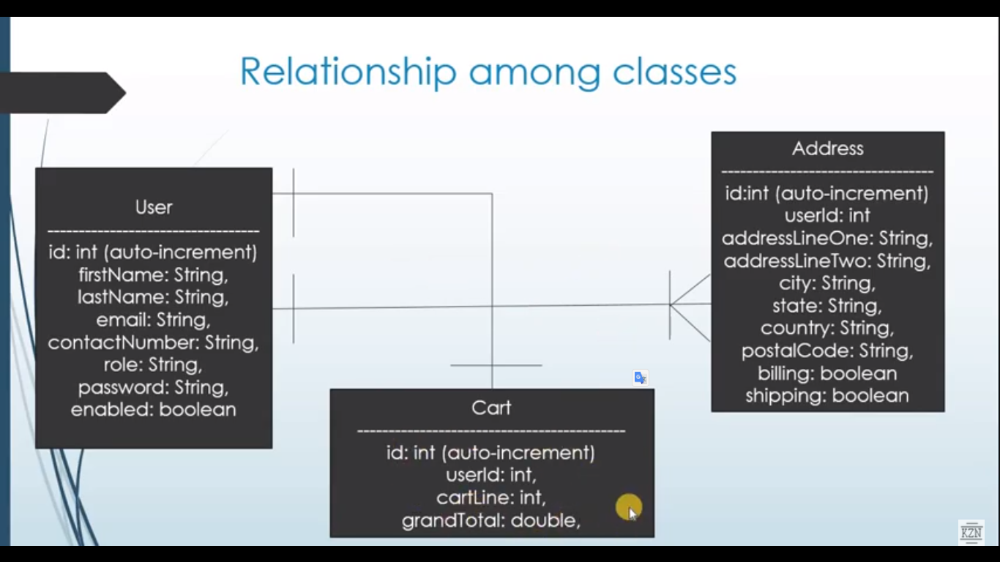
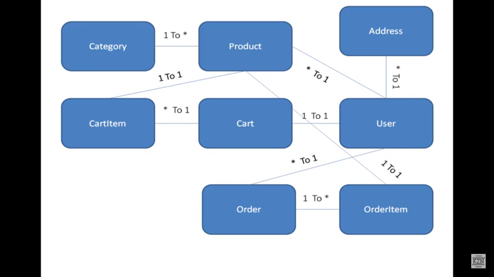

     
     
    <h3>shopping sample code using Webflow</h3>

 

### FrontEnd
 - onlineshopping

### BackEnd
 - shoppingbackend

This is a complete web application project for electronic devices online shopping. There are four main parts to the application: shopping, registering new user, checkout, and administration. 

#### Project Tools
It's developed using Spring MVC, Spring Security, Spring Webflow, Hibernate, Bootstrap and JQuery.

#### Database Usage
For the Database, this project using H2Database for simplicity of installation and you can build tables throw the Hibernate itself or by running the databaseQueries.sql file that located under the shoppingbackend folder. And by using the abovementioned sql file, you will be guarantee that a sample data will be inserted into the created tables.

#### Description

